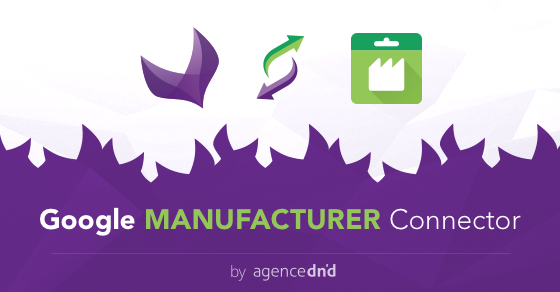

# Google Manufacturer Connector:

Google Manufacturer Connector allows you to export your products into XML format for Google Manufacturer.

It will create a new "Google Manufacturer - XML Products Export" export type in which you can map your Akeneo attributes to the mandatory attributes needed for Google Manufacturer exports. The connector will generate a XML file with the correct structure for Google Manufacturer integration.

### Documentation:

Google Manufacturer Connector complete documentation is available [here](doc/summary.md).

### How it works:

With Google Manufacturer Connector, you can:

* Create new Google Manufacturer export profiles
* Configure and map each mandatory attribute from Google Manufacturer to Akeneo attributes
* Configure and map each optional attribute from Google Manufacturer to Akeneo attributes
* Configure and generate "Product Detail" and "Feature Description" nodes from Akeneo attributes
* Generate XML file for Google Manufacturer

### Requirements:

* Akeneo 2.X

### About us:

Founded by lovers of innovation and design, [Agence Dn'D](https://www.dnd.fr) assists companies in the creation and development of customized digital (open source) solutions for web and E-commerce since 2004.
