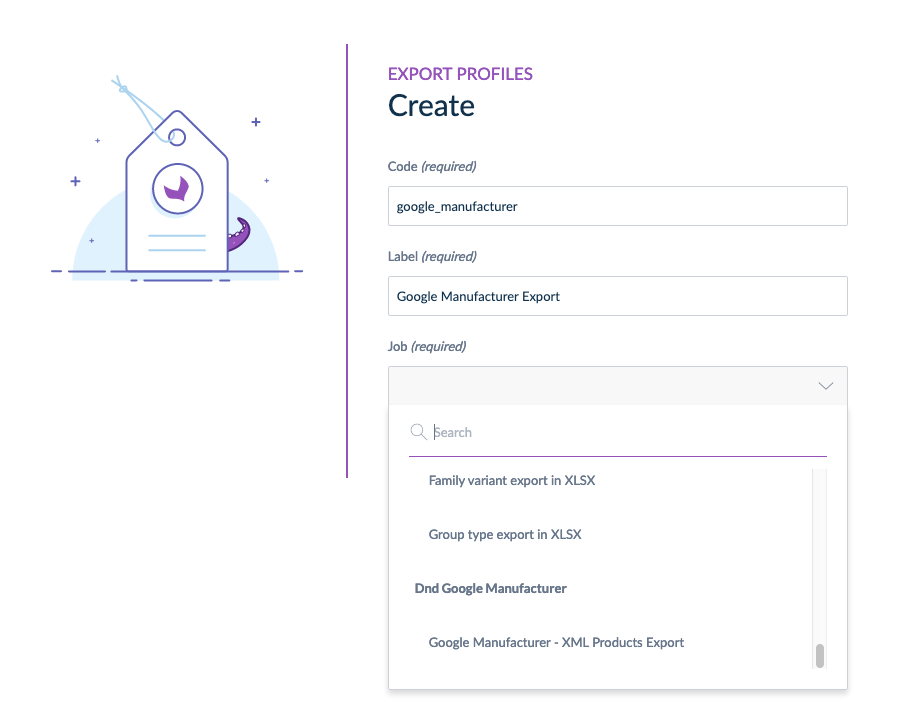
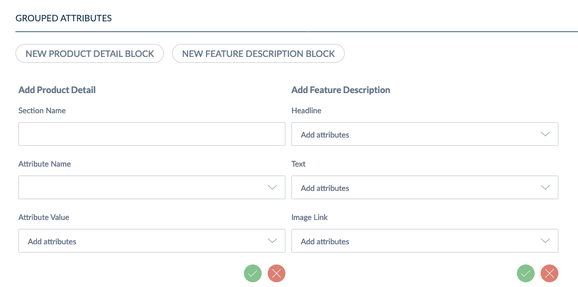

# Features:

### Create a Google Manufacturer export profile:

* Go to export tab and create a new export profile
* You can now select the "Google Manufacturer - XML Products Export" export type:



### Configure and map each mandatory attribute from Google Manufacturer to Akeneo PIM attributes:

* Google Manufacturer Connector allows you to map your Akeneo PIM attributes to the mandatory Google Manufacturer attributes from the export profile:


**The mandatory attributes are:**
* Identifier (id)
* GTIN (gtin)
* Title (title)
* Brand (brand)
* Description (description)
* Image Link (image_link)

### Configure and map each optional attribute from Google Manufacturer to Akeneo PIM attributes:

* Google Manufacturer Connector allows you to map your Akeneo PIM attributes to the optional Google Manufacturer attributes from the export profile on the same format than above.

**The optional attributes are:**
* Additional Image Link (additional_image_link)
* Age Group (age_group)
* Capacity (capacity)
* Color (color)
* Count (count)
* Disclosure date (disclosure_date)
* Flavor (flavor)
* Format (format)
* Gender (gender)
* Item Group ID (item_group_id)
* Material (material)
* MPN (mpn)
* Pattern (pattern)
* Product Line (product_line)
* Canonical name of the product (product_name)
* Product Page URL (product_page_url)
* Product Type (product_type)
* Release date (release_date)
* Scent (scent)
* Size (size)
* Size System (size_system)
* Size type (size_type)
* Suggested Retail Price (suggested_retail_price)
* Theme (theme)
* Video Link (video_link)
* Rich Product Content (rich_product_content)

### Configure and generate "Product Detail" and "Feature Description" nodes from Akeneo PIM attributes:

* You can configure specific "Product Detail" and "Feature Description" nodes directly on the profile configuration:



### Generate XML file for Google Manufacturer:

* After the configuration, save the profile and launch it to generate the XML file for Google Manufacturer

### Generate XML file for Google Manufacturer with command line:

* You can also trigger your Google Manufacturer export profile with Akeneo PIM native command line : 
```bash
bin/console akeneo:batch:job google_manufacturer_profile_code
```

##### [> Back to summary](../summary.md)